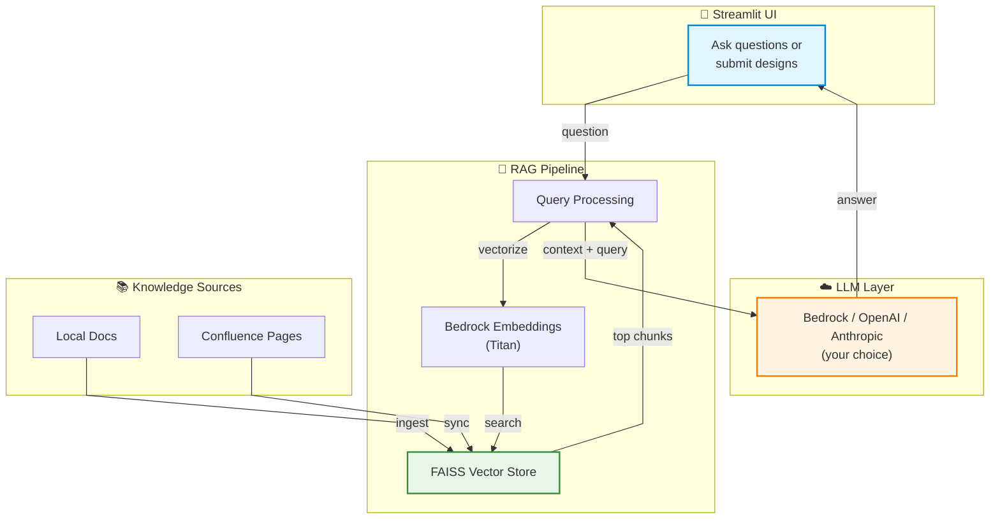

# 🏦 Architecture AI Suite

Got tired of searching through architecture docs and ADRs every time someone asked "what's our policy on X?" Built this to make life easier for our team. It's basically a smart Q&A bot that actually knows your standards, plus some audit tools to catch compliance issues before they become problems.

## What's Inside

Three tools that work together (one shipped, two coming):

**📚 Knowledge Bot** - Ask questions about your architecture docs in plain English. It searches through everything and gives you answers with sources, so you know it's not making stuff up.

**🔍 Solution Auditor** - Paste in a design doc (or grab it from Confluence), and it'll check compliance against your standards and ADRs. Gets you a nice table showing what's missing or needs fixing.

**✅ ADR Validator** *(coming)* - Make sure your ADRs don't contradict each other and stay current with what teams are actually doing.

## Why This Exists

Our architects kept getting pinged on Slack with the same questions. Security team wanted consistent answers. Design reviews took forever because people hadn't read the relevant ADRs. So I spent a weekend wiring up FAISS + LLMs to handle the grunt work.

Works with whatever LLM you've got access to - Bedrock (DeepSeek or Claude), OpenAI, Anthropic. Same code, your choice.

## What It Does

**Knowledge Bot:**
- Chat interface that doesn't feel like you're talking to a robot
- Searches your ADRs, standards, and policies in seconds
- Shows you exactly where the answer came from (with confidence scores)
- Supports local docs or pulls straight from Confluence
- Works offline for the search part (only hits the LLM for final answers)

**Solution Auditor:**
- Checks design docs against your standards automatically
- Highlights what's compliant, what's sketchy, what's broken
- Pulls in relevant ADRs from your knowledge base
- Can sync entire Confluence spaces (filtered by labels if you want)
- Uses a hybrid approach - checks your configured must-haves plus discovers new requirements from your standards docs

**Tech Details:**
- Model-agnostic - swap LLMs without changing code
- Bedrock embeddings (Titan) - no HuggingFace network calls, works behind corporate firewalls
- FAISS for vector search (runs on CPU, no GPU needed)
- Everything configurable via `.env` - no org name hardcoded anywhere
- Confluence integration for both pulling design docs and syncing your knowledge base

## How It Works



**In plain English:**

1. You ask a question or submit a design doc
2. System converts it to a vector and searches your knowledge base (FAISS)
3. Grabs the most relevant chunks from your ADRs and standards
4. Sends those chunks + your question to the LLM
5. LLM reads the context and answers based on *your actual docs*, not general internet knowledge
6. You get an answer with links to the source material

## 🚀 Quick Start

**Prerequisites:** Python 3.8+ and an LLM API key (AWS Bedrock, OpenAI, or Anthropic)

```bash
# 1. Install dependencies
pip install -r requirements.txt

# 2. Configure your setup
cp .env.example .env
cp config.env.example config.env
# Edit .env with your API credentials
# Edit config.env with your organization settings

# 3. Validate setup
python validate_setup.py

# 4. Launch the app
streamlit run app.py
```

**📖 Detailed Setup:** See [SETUP.md](SETUP.md) for complete setup instructions, configuration options, and troubleshooting.

**🎯 Try the Demo:** The repository includes sample ADRs and a pre-built FAISS index - you can start exploring immediately after step 1 and 4 (credentials needed only for LLM queries).

## Using It

**Knowledge Bot:**

Just ask questions like you'd ask a colleague:
- "What's our data residency policy for Hong Kong?"
- "How should we handle PII in microservices?"
- "List all ADRs related to authentication"

**Solution Auditor:**

Two ways to audit a design:
1. Paste the design text directly in the UI
2. Drop a Confluence URL and it'll fetch the page for you

Either way, you get a compliance table showing what's good, what's missing, and what needs fixing.

**Confluence Sync:**

Hit the "Sync from Confluence" button in the sidebar. It'll pull all pages from your configured space (filtered by labels if you set them) and merge them into the knowledge base. Then you can ask questions about those docs too.

**Adding Docs:**

Drop Markdown files in the `docs/` folder, run `python ingest.py`, done. Or use the Confluence sync if your docs live there.

## Configuration

**LLM Providers** (pick one in `.env`):

| Provider | Config | Cost | Use Case |
|----------|--------|------|----------|
| AWS Bedrock (DeepSeek) | `MODEL_PROVIDER=bedrock`<br>`MODEL_NAME=us.deepseek.r1-v1:0` | Cheapest (~$0.40/M tokens) | Direct AWS access |
| AWS Bedrock (Claude) | `MODEL_PROVIDER=bedrock`<br>`MODEL_NAME=anthropic.claude-3-sonnet-20240229-v1:0` | Mid-range | Direct AWS access |
| OpenAI | `MODEL_PROVIDER=openai`<br>`MODEL_NAME=gpt-4` | Most expensive | Direct OpenAI access |
| Anthropic | `MODEL_PROVIDER=anthropic`<br>`MODEL_NAME=claude-3-opus-20240229` | High-end | Direct Anthropic access |
| **OpenWebUI (Proxy)** | `MODEL_PROVIDER=openwebui`<br>`MODEL_NAME=deepseek-r1`<br>`OPENWEBUI_BASE_URL=https://your-instance.com/api/v1`<br>`OPENWEBUI_API_KEY=your-key` | Varies | **No direct AWS access**<br>Uses OpenWebUI as proxy |

**Embeddings** (in `.env`):

Default is Bedrock Titan (`EMBEDDING_PROVIDER=bedrock`). Works behind corporate firewalls, costs basically nothing (<$1/month for most orgs). Can also use OpenAI, HuggingFace, or OpenWebUI if you prefer.

| Provider | Config | Notes |
|----------|--------|-------|
| Bedrock Titan | `EMBEDDING_PROVIDER=bedrock`<br>`EMBEDDING_MODEL=amazon.titan-embed-text-v2:0` | Default, requires AWS |
| OpenAI | `EMBEDDING_PROVIDER=openai`<br>`EMBEDDING_MODEL=text-embedding-3-small` | Requires OpenAI API key |
| HuggingFace | `EMBEDDING_PROVIDER=huggingface`<br>`EMBEDDING_MODEL=sentence-transformers/all-MiniLM-L6-v2` | Local, free |
| **OpenWebUI** | `EMBEDDING_PROVIDER=openwebui`<br>`EMBEDDING_MODEL=text-embedding-3-small`<br>`OPENWEBUI_BASE_URL=https://your-instance.com/api/v1`<br>`OPENWEBUI_API_KEY=your-key` | **For environments without AWS access** |

**Organization Settings** (in `config.env`):

```env
ORGANIZATION_NAME=Your Company          # Shows up in UI
ORGANIZATION_ICON=🚀                    # Pick an emoji
PRIORITY_ADRS=ADR-001,ADR-005          # ADRs to always check
RERANKING_KEYWORDS=aws,k8s,pii,gdpr    # Boosts relevant docs
AUDIT_ASPECTS=Security,GDPR,APIs       # What audits check (hybrid mode auto-adds more)
CONFLUENCE_SPACE_KEY=ARCH              # Confluence space to sync
CONFLUENCE_LABELS=adr,standards        # Filter pages by labels
```

No code changes needed to customize for your org. Same codebase works everywhere.

## Security & Data Privacy

**What Gets Sent to the LLM:**
- Architecture decision records (ADRs)
- Design patterns and standards
- Technical policies and guidelines
- Solution design documents (architecture metadata)

**What NEVER Gets Sent:**
- ❌ Customer PII (Personal Identifiable Information)
- ❌ Production data or credentials
- ❌ Sensitive business data
- ❌ API keys or secrets

**Data Processing:**
- Only architectural and policy documents are embedded and queried
- Design documents submitted for audit contain technical architecture (not customer data)
- All LLM requests contain architectural context only - no business-sensitive information
- FAISS embeddings run locally - no external calls for search

**For Regulated Industries (Banks, Healthcare, Finance):**
- ✅ Compliant with data residency requirements (embeddings stored locally)
- ✅ No customer data exposure risk (architecture docs only)
- ✅ Audit trail available (all queries can be logged)
- ✅ Air-gapped deployment possible (use local LLM instead of cloud)
- ✅ Configurable for on-premise deployment

**Hong Kong Digital Bank Requirements:**
This tool is designed for architecture governance only. It processes:
- Technical architecture documents
- Infrastructure designs
- Security policies and controls
- Compliance frameworks and ADRs

It does NOT process or have access to:
- Customer financial data
- Transaction records
- Customer identification documents
- Account balances or payment information

**Recommendation:** Deploy in a separate VPC/network segment from production systems for additional isolation.

## Sample Output

Want to see what the auditor produces? Check out the [`samples/`](samples/) folder:

- [`sample_design.md`](samples/sample_design.md) - Example e-commerce design document
- [`sample_audit_report.md`](samples/sample_audit_report.md) - Full audit output showing compliance findings
- Demonstrates the "product" - what you get from the Solution Auditor

The sample shows a realistic audit finding non-compliant data residency (database in us-east-1 instead of Hong Kong's ap-east-1) and authentication patterns not matching ADR-008.

## 📝 Adding New Documents

**Option 1: Local Files**
1. Drop your Markdown files into the `docs/` folder
2. Re-run the ingestion: `python ingest.py`
3. Restart the Streamlit app

**Option 2: Confluence Sync**
1. Configure Confluence credentials in `.env`
2. Set `CONFLUENCE_SPACE_KEY` in `config.env`
3. Use the "Sync from Confluence" button in the app sidebar

**💡 Tip:** See [SETUP.md](SETUP.md) for detailed instructions on document management, Confluence integration, and advanced configuration.

## 🌐 Using OpenWebUI as a Proxy

**When to use OpenWebUI:**
- Your environment doesn't provide direct AWS Bedrock access
- You have an OpenWebUI instance set up as a proxy to Bedrock or other LLMs
- You want centralized API management through OpenWebUI

**Setup for OpenWebUI:**

1. **Use the example configuration:**
   ```bash
   # Copy the OpenWebUI example configuration
   cp .env.openwebui.example .env
   
   # Edit .env and update with your credentials
   # - OPENWEBUI_API_KEY
   # - OPENWEBUI_BASE_URL
   # - MODEL_NAME (check available models in your OpenWebUI instance)
   ```

   Or manually configure your `.env` file:
   ```env
   # LLM Configuration
   MODEL_PROVIDER=openwebui
   MODEL_NAME=deepseek-r1  # or any model available in your OpenWebUI instance
   OPENWEBUI_API_KEY=your-openwebui-api-key-here
   OPENWEBUI_BASE_URL=https://your-openwebui-instance.com/api/v1
   
   # Embeddings Configuration (if using OpenWebUI for embeddings too)
   EMBEDDING_PROVIDER=openwebui
   EMBEDDING_MODEL=text-embedding-3-small  # or any embedding model in OpenWebUI
   ```

2. **Get your OpenWebUI API key:**
   - Log into your OpenWebUI instance
   - Go to Settings → Account → API Keys
   - Generate a new API key
   - Copy it to your `.env` file

3. **Verify the model name:**
   - Check which models are available in your OpenWebUI instance
   - Use the exact model name as shown in OpenWebUI
   - Common examples: `deepseek-r1`, `claude-3-sonnet`, `gpt-4`

4. **Test the connection:**
   ```bash
   # Run the OpenWebUI test script
   python test_openwebui.py
   ```
   
   This will verify:
   - ✅ Environment variables are set correctly
   - ✅ Connection to OpenWebUI is working
   - ✅ Model is accessible
   - ✅ Embeddings are working (if configured)

**OpenWebUI API Compatibility:**
- OpenWebUI provides an OpenAI-compatible API
- The code uses the `openai` Python library with a custom base URL
- Both LLM inference and embeddings are supported
- No changes needed to application code - just configuration

**Architecture with OpenWebUI:**
```
[App] → [OpenWebUI Proxy] → [AWS Bedrock / Other LLM]
  ↓
[FAISS Index] (local)
```

**For detailed setup instructions, troubleshooting, and examples:**
📖 See [docs/OPENWEBUI_SETUP.md](docs/OPENWEBUI_SETUP.md) for the complete OpenWebUI setup guide.

## Troubleshooting

**App won't start / import errors**
- Make sure you activated the venv: `.venv\Scripts\Activate.ps1`
- Run `pip install -r requirements.txt` again

**FAISS index not found**
- Run `python ingest.py` first - it creates the index from your docs

**Bedrock errors**
- Check `.env` has valid AWS credentials
- Make sure you're in a Bedrock-supported region (us-east-1 works)
- Verify DeepSeek or Claude is enabled in your AWS account

**Confluence sync not working**
- Need `CONFLUENCE_EMAIL`, `CONFLUENCE_API_TOKEN`, and `CONFLUENCE_BASE_URL` in `.env`
- API token needs read permissions on the space
- Check the space key is correct in `config.env`

**OpenWebUI connection errors**
- Verify `OPENWEBUI_BASE_URL` is correct (should end with `/api/v1`)
- Check `OPENWEBUI_API_KEY` is valid (generate new one if needed)
- Ensure the model name matches what's available in your OpenWebUI instance
- Test connectivity: `curl -H "Authorization: Bearer YOUR_KEY" YOUR_BASE_URL/models`
- Check OpenWebUI instance is accessible from your network

**Answers seem wrong**
- Double-check your docs folder has the right content
- Try rephrasing the question
- Increase retrieval chunks in `brain.py` if needed

**Corporate firewall blocking HuggingFace**
- Already handled - we use Bedrock embeddings by default (no external network calls)
- Set `EMBEDDING_PROVIDER=bedrock` in `.env`
- Or use `EMBEDDING_PROVIDER=openwebui` if you have OpenWebUI access

## What's Under the Hood

- **Streamlit** - UI framework
- **FAISS** - Vector search (CPU-based, runs locally)
- **AWS Bedrock Titan** - Embeddings (1024-dim, firewall-friendly)
- **LangChain** - Glue that holds the RAG pipeline together
- **Model-agnostic LLM layer** - Swap between Bedrock/OpenAI/Anthropic without code changes

Total cost for embeddings: <$1/month for most orgs. LLM costs depend on which one you pick.

## What's Next

Stuff I'm thinking about adding:

- ADR Validator mode (catch contradictions between decisions)
- Diagram analysis using vision models (GPT-4V/Claude can read architecture diagrams)
- PDF and DOCX support
- Multi-turn conversations (memory)
- Slack/Teams bot integration
- Docker container
- Export audit reports as Confluence comments

If you build something cool with this, let me know!

## License

MIT or whatever. Use it however you want. If it saves your team some time, that's awesome.

---

*Built during evenings and weekends because searching through Confluence pages manually is painful.*
