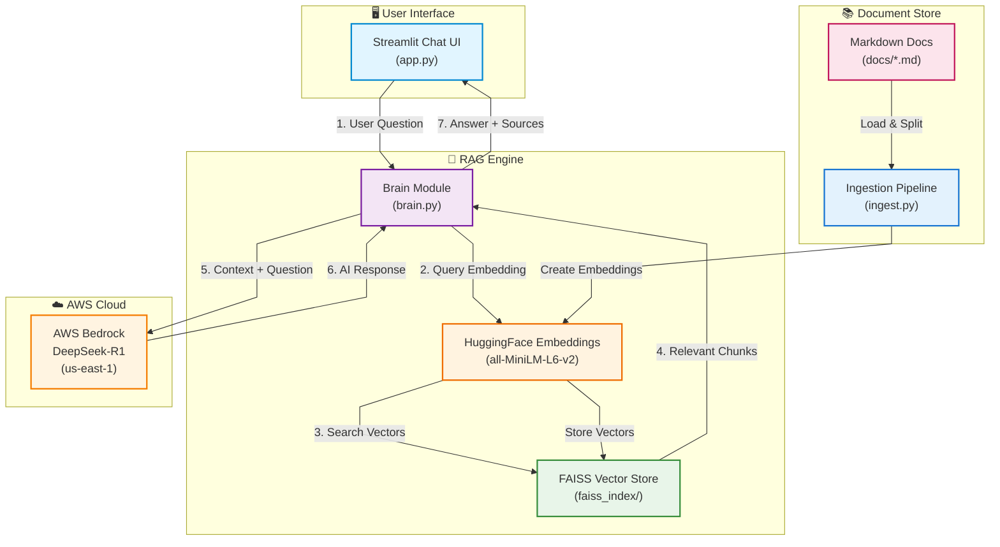

# 🏦 Digital Bank AI Architecture Auditor

Ever wish you had an AI assistant that actually knew your architecture docs inside and out? Well, here you go! This tool helps you quickly find answers about architecture decisions, security policies, and design standards without digging through dozens of Markdown files.

## What's This All About?

Built this to solve a real problem: our team kept asking the same questions about architecture decisions, security requirements, and design patterns. Instead of searching through ADRs and policy docs manually (or bothering the architects on Slack), I put together this RAG-powered Q&A system that does the heavy lifting.

It uses DeepSeek-R1 on AWS Bedrock with a local FAISS vector store to give you accurate, context-aware answers based on your actual documentation.

## ✨ Features

- **Chat Interface**: Clean Streamlit UI that feels like talking to a colleague
- **Smart Search**: Uses semantic search to find relevant docs, not just keyword matching
- **Source Citations**: Every answer shows you exactly which documents it came from
- **Fast & Local**: Embeddings run locally, no need to call external APIs for every search
- **Cost Efficient**: Only hits AWS Bedrock for the final answer generation

## 🏗️ Architecture

Here's how it all fits together:



**The Flow:**

1. You ask a question through the Streamlit interface
2. `brain.py` converts your question into a vector using local embeddings
3. FAISS searches the vector store for the most relevant document chunks
4. The top results get bundled with your question into a prompt
5. DeepSeek-R1 on AWS Bedrock generates a context-aware answer
6. You get the answer plus links to the source documents

## 🚀 Getting Started

### Prerequisites

- Python 3.8+
- AWS account with Bedrock access (DeepSeek-R1 enabled)
- AWS credentials configured

### Installation

1. **Clone and navigate:**
   ```bash
   cd architecture-ai-auditor
   ```

2. **Set up virtual environment:**
   ```bash
   python -m venv .venv
   .venv\Scripts\Activate.ps1  # Windows
   # or
   source .venv/bin/activate  # Linux/Mac
   ```

3. **Install dependencies:**
   ```bash
   pip install -r requirements.txt
   ```

4. **Configure AWS credentials:**
   
   Create a `.env` file in the project root:
   ```env
   AWS_ACCESS_KEY_ID=your_access_key_here
   AWS_SECRET_ACCESS_KEY=your_secret_key_here
   AWS_REGION=us-east-1
   ```

5. **Ingest your documents:**
   
   This processes all Markdown files in the `docs/` folder and creates the vector index:
   ```bash
   python ingest.py
   ```
   
   You should see something like:
   ```
   ✅ Successfully created FAISS index with 42 chunks
   ```

6. **Run the app:**
   ```bash
   streamlit run app.py
   ```
   
   The UI will open at `http://localhost:8501`

## 💬 Usage

Just type your questions in the chat! Here are some examples:

- "What are the foundational principles for microservices architecture?"
- "What's our data residency policy for Hong Kong?"
- "List all architecture decision records"
- "How should we handle authentication and authorization?"

The AI will search through your docs and give you answers with source citations. Click the "Sources" expander to see which documents were used.

## 📁 Project Structure

```
architecture-ai-auditor/
├── app.py                  # Streamlit UI
├── brain.py                # RAG logic & DeepSeek-R1 integration
├── ingest.py               # Document ingestion pipeline
├── requirements.txt        # Python dependencies
├── .env                    # AWS credentials (not committed)
├── docs/                   # Your architecture documents
│   ├── adr_fargate.md
│   ├── ADR-006-Event-Driven-Architecture.md
│   ├── security_policy.md
│   └── ...
└── faiss_index/           # Vector store (generated)
    └── index.faiss
```

## 🔧 Configuration

### Embeddings Model

Currently using `sentence-transformers/all-MiniLM-L6-v2` which runs locally. It's fast and good enough for most use cases. If you want better accuracy, you can swap it for a larger model in both `ingest.py` and `brain.py`.

### Chunk Size

Documents are split into 1000-character chunks with 200-character overlap. Tune these in `ingest.py` if you're working with different doc types:

```python
text_splitter = RecursiveCharacterTextSplitter(
    chunk_size=1000,
    chunk_overlap=200,
)
```

### LLM Parameters

In `brain.py`, you can adjust the DeepSeek-R1 parameters:

```python
invoke_deepseek_r1(
    prompt,
    max_tokens=1024,      # Increase for longer answers
    temperature=0.7,      # Lower for more focused answers
    top_p=0.9
)
```

## 📝 Adding New Documents

1. Drop your Markdown files into the `docs/` folder
2. Re-run the ingestion:
   ```bash
   python ingest.py
   ```
3. Restart the Streamlit app

That's it! The new docs will be searchable immediately.

## 🤔 Troubleshooting

**"FAISS index not found"**
- Run `python ingest.py` first to create the index

**AWS Bedrock errors**
- Check your `.env` file has valid credentials
- Verify DeepSeek-R1 is enabled in your AWS region (us-east-1)
- Make sure you have Bedrock permissions

**Embeddings model download hangs**
- First run downloads the model (~80MB), be patient
- Check your internet connection
- Model gets cached in `~/.cache/huggingface/`

**Answers seem off**
- Try rephrasing your question
- Check if the relevant docs are in the `docs/` folder
- Increase `k` value in `brain.py` to retrieve more context chunks

## 🛠️ Tech Stack

- **UI**: Streamlit
- **Vector Store**: FAISS (CPU-based, local)
- **Embeddings**: HuggingFace Transformers (all-MiniLM-L6-v2)
- **LLM**: DeepSeek-R1 via AWS Bedrock
- **Framework**: LangChain

## 💡 Future Ideas

Some things I'm thinking about adding:

- [ ] Support for PDF and DOCX files
- [ ] Conversation memory (multi-turn Q&A)
- [ ] Admin panel to manage docs
- [ ] Export chat history
- [ ] Support for other LLMs (Claude, GPT-4, etc.)
- [ ] Docker containerization

## 📄 License

Do whatever you want with this. If it helps your team, that's awesome!

---

Built with ☕ and mild frustration at having to search through docs manually.
