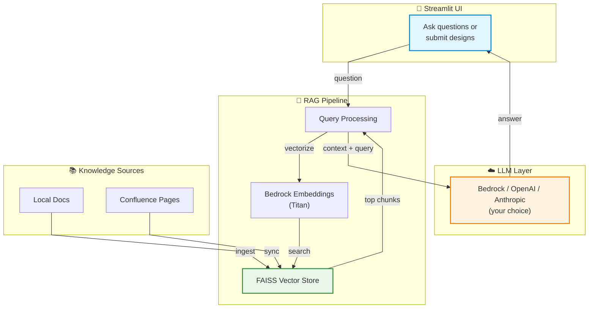

# 🏦 Architecture AI Suite

Got tired of searching through architecture docs and ADRs every time someone asked "what's our policy on X?" Built this to make life easier for our team. It's basically a smart Q&A bot that actually knows your standards, plus some audit tools to catch compliance issues before they become problems.

## What's Inside

Three tools that work together (one shipped, two coming):

**📚 Knowledge Bot** - Ask questions about your architecture docs in plain English. It searches through everything and gives you answers with sources, so you know it's not making stuff up.

**🔍 Solution Auditor** - Paste in a design doc (or grab it from Confluence), and it'll check compliance against your standards and ADRs. Gets you a nice table showing what's missing or needs fixing.

**✅ ADR Validator** *(coming)* - Make sure your ADRs don't contradict each other and stay current with what teams are actually doing.

## Why This Exists

Our architects kept getting pinged on Slack with the same questions. Security team wanted consistent answers. Design reviews took forever because people hadn't read the relevant ADRs. So I spent a weekend wiring up FAISS + LLMs to handle the grunt work.

Works with whatever LLM you've got access to - Bedrock (DeepSeek or Claude), OpenAI, Anthropic. Same code, your choice.

## What It Does

**Knowledge Bot:**
- Chat interface that doesn't feel like you're talking to a robot
- Searches your ADRs, standards, and policies in seconds
- Shows you exactly where the answer came from (with confidence scores)
- Supports local docs or pulls straight from Confluence
- Works offline for the search part (only hits the LLM for final answers)

**Solution Auditor:**
- Checks design docs against your standards automatically
- Highlights what's compliant, what's sketchy, what's broken
- Pulls in relevant ADRs from your knowledge base
- Can sync entire Confluence spaces (filtered by labels if you want)
- Uses a hybrid approach - checks your configured must-haves plus discovers new requirements from your standards docs

**Tech Details:**
- Model-agnostic - swap LLMs without changing code
- Bedrock embeddings (Titan) - no HuggingFace network calls, works behind corporate firewalls
- FAISS for vector search (runs on CPU, no GPU needed)
- Everything configurable via `.env` - no org name hardcoded anywhere
- Confluence integration for both pulling design docs and syncing your knowledge base

## How It Works



**In plain English:**

1. You ask a question or submit a design doc
2. System converts it to a vector and searches your knowledge base (FAISS)
3. Grabs the most relevant chunks from your ADRs and standards
4. Sends those chunks + your question to the LLM
5. LLM reads the context and answers based on *your actual docs*, not general internet knowledge
6. You get an answer with links to the source material

## Setup

**What you need:**
- Python 3.8+
- AWS account with Bedrock enabled (or OpenAI/Anthropic API key)
- Your architecture docs (Markdown files work best, Confluence integration available)

**Quick start:**

```bash
# 1. Clone and get into the folder
cd architecture-ai-suite

# 2. Virtual environment (keeps things clean)
python -m venv .venv
.venv\Scripts\Activate.ps1  # Windows PowerShell
# source .venv/bin/activate  # Mac/Linux

# 3. Install stuff
pip install -r requirements.txt

# 4. Copy config templates
cp config.env.example config.env
cp .env.example .env

# 5. Edit .env with your credentials
# - For Bedrock: AWS keys and region
# - For OpenAI: API key
# - For Anthropic: API key
# - For Confluence: email + API token (optional)

# 6. Edit config.env for your org
# - Company name and icon
# - Your critical ADRs
# - Tech stack keywords
# - What to check in audits

# 7. Load your docs into the knowledge base
python ingest.py

# 8. Fire it up
streamlit run app.py
```

Open `http://localhost:8501` and start asking questions.

## Using It

**Knowledge Bot:**

Just ask questions like you'd ask a colleague:
- "What's our data residency policy for Hong Kong?"
- "How should we handle PII in microservices?"
- "List all ADRs related to authentication"

**Solution Auditor:**

Two ways to audit a design:
1. Paste the design text directly in the UI
2. Drop a Confluence URL and it'll fetch the page for you

Either way, you get a compliance table showing what's good, what's missing, and what needs fixing.

**Confluence Sync:**

Hit the "Sync from Confluence" button in the sidebar. It'll pull all pages from your configured space (filtered by labels if you set them) and merge them into the knowledge base. Then you can ask questions about those docs too.

**Adding Docs:**

Drop Markdown files in the `docs/` folder, run `python ingest.py`, done. Or use the Confluence sync if your docs live there.

## Configuration

**LLM Providers** (pick one in `.env`):

| Provider | Config | Cost |
|----------|--------|------|
| AWS Bedrock (DeepSeek) | `MODEL_PROVIDER=bedrock`<br>`MODEL_NAME=us.deepseek.r1-v1:0` | Cheapest (~$0.40/M tokens) |
| AWS Bedrock (Claude) | `MODEL_PROVIDER=bedrock`<br>`MODEL_NAME=anthropic.claude-3-sonnet-20240229-v1:0` | Mid-range |
| OpenAI | `MODEL_PROVIDER=openai`<br>`MODEL_NAME=gpt-4` | Most expensive |
| Anthropic | `MODEL_PROVIDER=anthropic`<br>`MODEL_NAME=claude-3-opus-20240229` | High-end |

**Embeddings** (in `.env`):

Default is Bedrock Titan (`EMBEDDING_PROVIDER=bedrock`). Works behind corporate firewalls, costs basically nothing (<$1/month for most orgs). Can also use OpenAI or HuggingFace if you prefer.

**Organization Settings** (in `config.env`):

```env
ORGANIZATION_NAME=Your Company          # Shows up in UI
ORGANIZATION_ICON=🚀                    # Pick an emoji
PRIORITY_ADRS=ADR-001,ADR-005          # ADRs to always check
RERANKING_KEYWORDS=aws,k8s,pii,gdpr    # Boosts relevant docs
AUDIT_ASPECTS=Security,GDPR,APIs       # What audits check (hybrid mode auto-adds more)
CONFLUENCE_SPACE_KEY=ARCH              # Confluence space to sync
CONFLUENCE_LABELS=adr,standards        # Filter pages by labels
```

No code changes needed to customize for your org. Same codebase works everywhere.

## 📝 Adding New Documents

1. Drop your Markdown files into the `docs/` folder
2. Re-run the ingestion:
   ```bash
   python ingest.py
   ```
3. Restart the Streamlit app

That's it! The new docs will be searchable immediately.

## Troubleshooting

**App won't start / import errors**
- Make sure you activated the venv: `.venv\Scripts\Activate.ps1`
- Run `pip install -r requirements.txt` again

**FAISS index not found**
- Run `python ingest.py` first - it creates the index from your docs

**Bedrock errors**
- Check `.env` has valid AWS credentials
- Make sure you're in a Bedrock-supported region (us-east-1 works)
- Verify DeepSeek or Claude is enabled in your AWS account

**Confluence sync not working**
- Need `CONFLUENCE_EMAIL`, `CONFLUENCE_API_TOKEN`, and `CONFLUENCE_BASE_URL` in `.env`
- API token needs read permissions on the space
- Check the space key is correct in `config.env`

**Answers seem wrong**
- Double-check your docs folder has the right content
- Try rephrasing the question
- Increase retrieval chunks in `brain.py` if needed

**Corporate firewall blocking HuggingFace**
- Already handled - we use Bedrock embeddings by default (no external network calls)
- Set `EMBEDDING_PROVIDER=bedrock` in `.env`

## What's Under the Hood

- **Streamlit** - UI framework
- **FAISS** - Vector search (CPU-based, runs locally)
- **AWS Bedrock Titan** - Embeddings (1024-dim, firewall-friendly)
- **LangChain** - Glue that holds the RAG pipeline together
- **Model-agnostic LLM layer** - Swap between Bedrock/OpenAI/Anthropic without code changes

Total cost for embeddings: <$1/month for most orgs. LLM costs depend on which one you pick.

## What's Next

Stuff I'm thinking about adding:

- ADR Validator mode (catch contradictions between decisions)
- Diagram analysis using vision models (GPT-4V/Claude can read architecture diagrams)
- PDF and DOCX support
- Multi-turn conversations (memory)
- Slack/Teams bot integration
- Docker container
- Export audit reports as Confluence comments

If you build something cool with this, let me know!

## License

MIT or whatever. Use it however you want. If it saves your team some time, that's awesome.

---

*Built during evenings and weekends because searching through Confluence pages manually is painful.*
